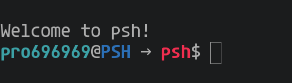

# psh: a fancy POSIX-like shell

<div align="center">

</div>

> This project is part of [Tilde 3.0](https://github.com/homebrew-ec-foss/Tilde-3.0) HSP PESU-ECC's summer mentoring program: where 5 students developed this project under the guidance of 4 mentors.

## High Level Design 


## Flow


## Run locally
```bash
git clone https://github.com/homebrew-ec-foss/psh; cd psh
make run
```

## Contributors:
- [Aditya R](https://github.com/adityatr64)
- [Krishna Kumar](https://github.com/Pro696969)
- [Alayna Monteiro](https://github.com/AlaynaMonteiro)
- [Sumithra Suresh](https://github.com/2sumithrasuresh)
- [Siddhartha Rao](https://github.com/ninsid711)

## Mentors:
- [Nathan Paul](https://github.com/polarhive)
- [Tejas R](https://github.com/tejas-techstack)
- [Anupam G](https://github.com/g-anupam)
- [Navneet Nayak](https://github.com/NavneetNayak)

## Devlogs
- [week-1](docs/slides/README.md)
- [week-2](docs/slides/week-2.pdf)
- [week-3](docs/slides/week-3.pdf)
- [week-4](docs/slides/week-4.pdf)
- [week-5](docs/slides/week-5.pdf) (final review)
